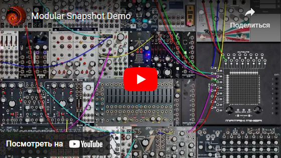
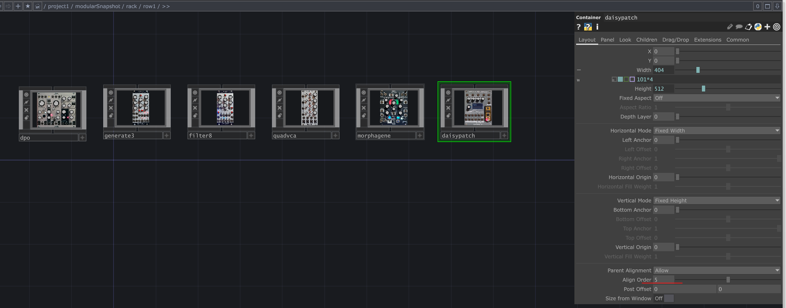
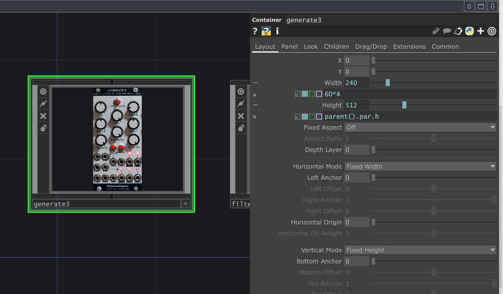
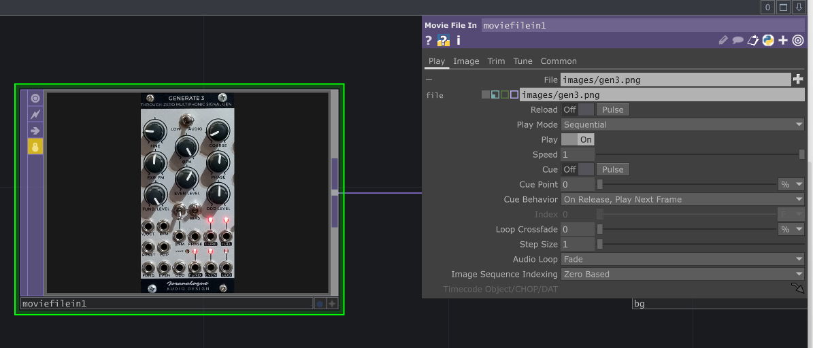
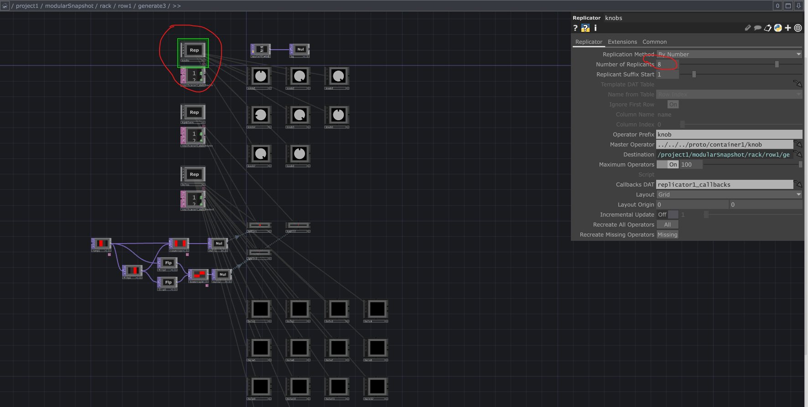
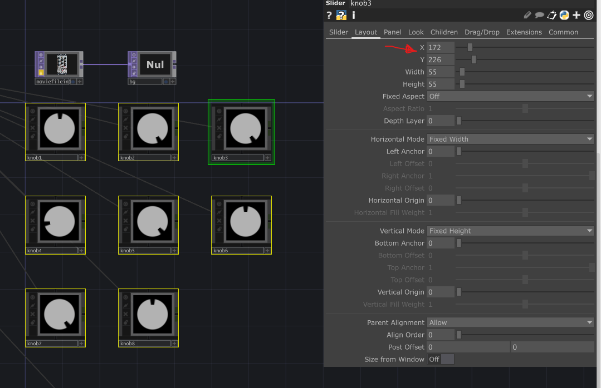
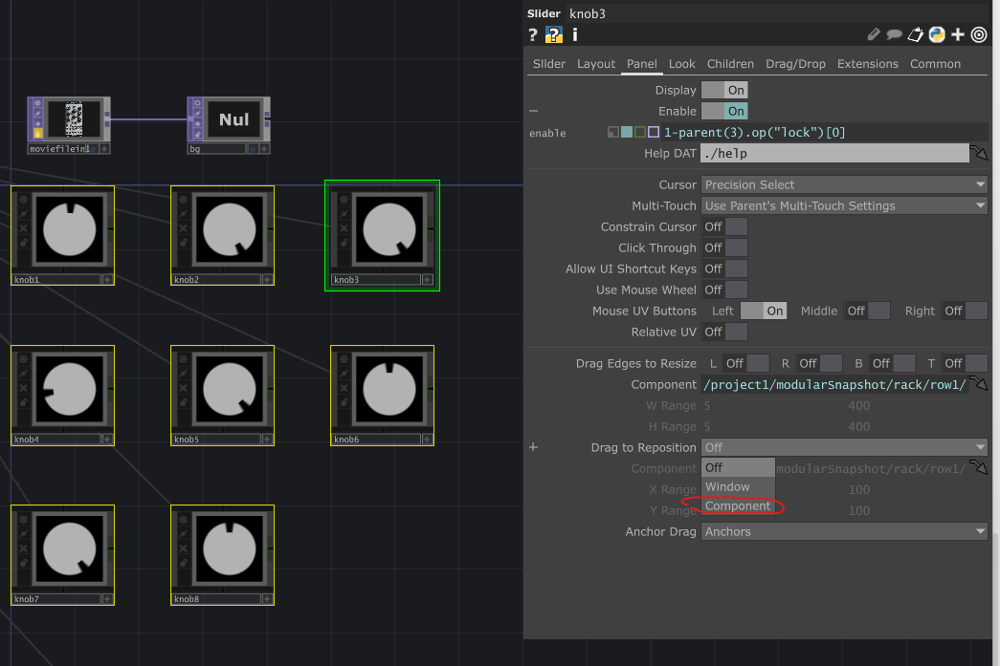
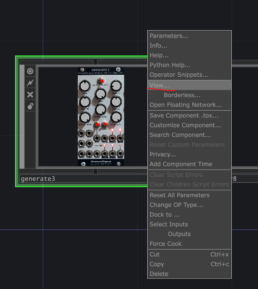
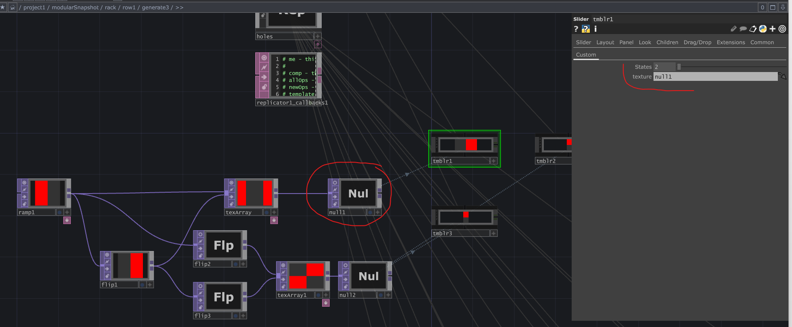

# Modular Snapshot

This is a touchdesigner component, which allows you to save the snapshot of a Eurorack patch. Includes the state of all controls and patch cables. Allows you to create easily reproducible live setups. You can easily scale this system by adding your own modules using the templates and approaches provided in this example. I love the way of interaction with modular synthesiser, but it  has obvious disadvantages. 

This is my own setup, maded for personal usage in my audio-visual projects, but I think it can be easily changed for your system. 

## How to add a new module in system.

1. Copy one of already exists, which have all type of controls you need. And set align order to actual order value.

2. After that you need set width to needed value (save proportion of real module)

3. Update panel photo inside locked moviefilein

4. Each module have replicators inside for each type of controls. Set replicator number parameter to number which you need

5. Select all controls of this type and set x and y values, to zero.

6. Next step - set darg to reposition parameter to component.

8. Open view of module in a separate window and set actual positions of controls with mouse
 
9. After that you need set drag to reposition parameter to off.

10. Tumblers is just sliders with additioanl parameters. You need selec horisontal or vrtical mode, after that - set background texture and count of states

All default control types have prototipes in ./proto/container1. You can update content of it and it will be updated in all places where it used (all controls in clone mode)
Some specific modules, like rene and matrix uses more complex approaches to recreate pages and presets mechanics.

Also exists renaming tools and generic script template. You can use it to update something on hi level after something was created. 

Feel free to suggest how to improve this tool. Hope it will be usefull not only for me.
